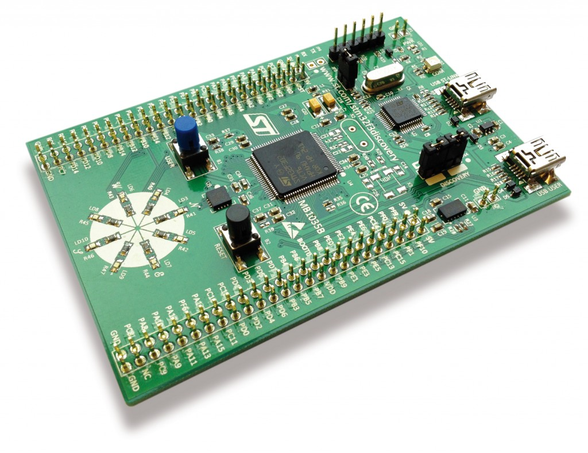
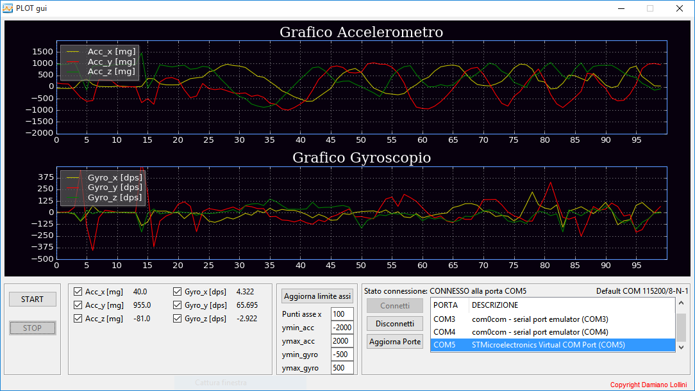

STM32F3DISCOVERY_IMU
====================

 DESCRIZIONE PROGETTO:
 -----------------
 
 Progetto completo (firmware e software) di un sistema IMU.

 Board					-->     STM32F3-Discovery

 Software per firmware	-->     IDE Ewarm.

 Software plot			-->     Python, gui tkinter, matplotlib

### Board STM32F3-Discovery

### PLOT Preview

